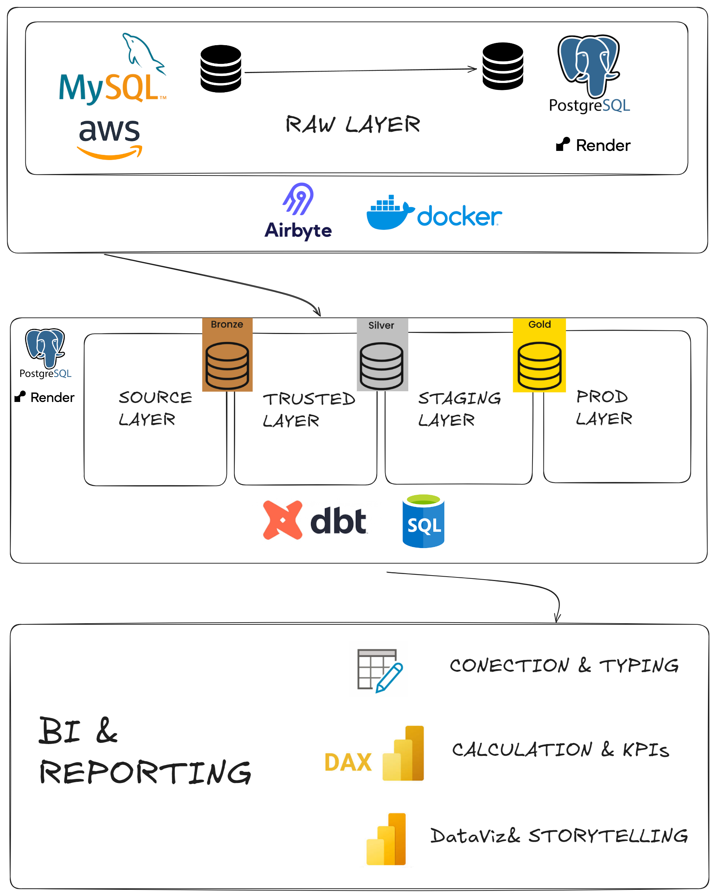
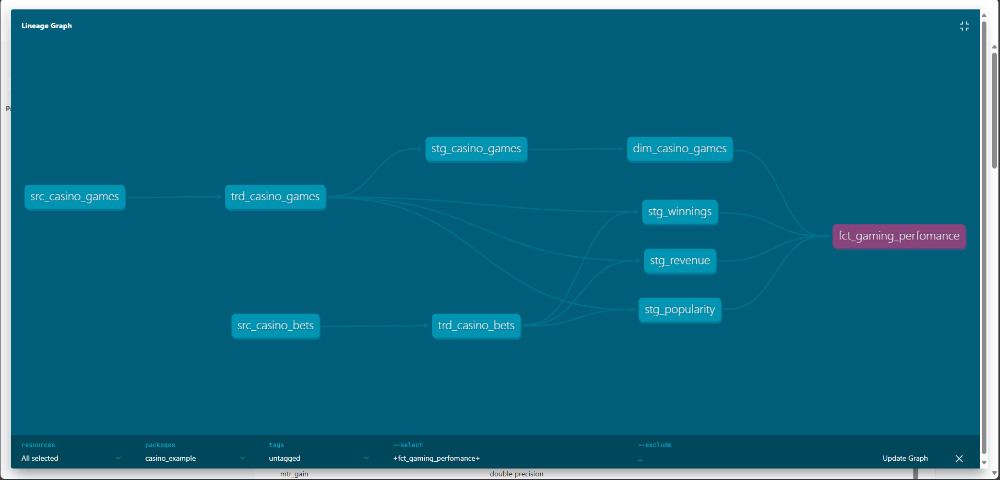
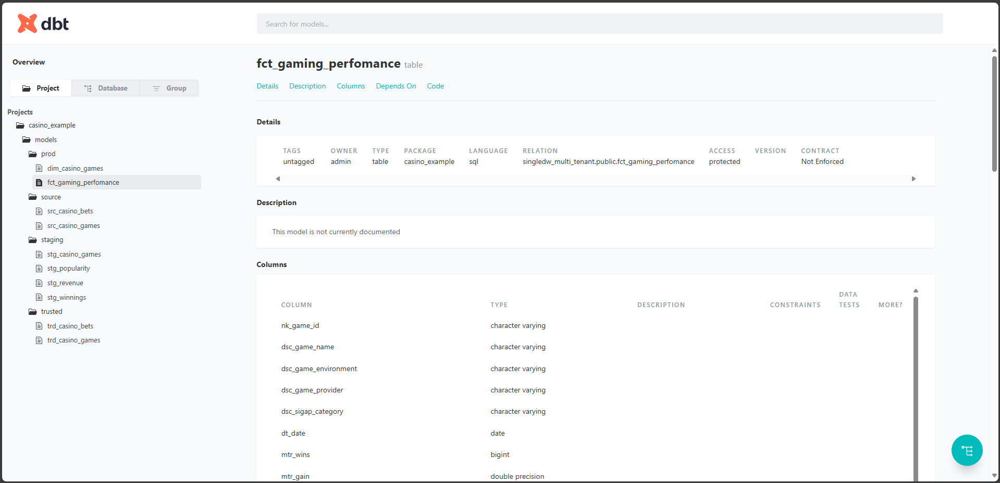

# Casino DBT Analytics

Este projeto demonstra uma arquitetura moderna de dados analíticos para operações de cassino, utilizando dbt (Data Build Tool) para modelagem e transformação, além de Power BI para análise e visualização. A seguir, apresento um resumo do fluxo de dados e das principais camadas do projeto, ilustradas nas imagens abaixo.

---

## Arquitetura do Pipeline de Dados

A arquitetura é composta por múltiplas camadas, cada uma com um papel específico no processamento e governança dos dados:

- **Raw Layer:**  
  Dados brutos são extraídos de fontes como MySQL (AWS) e carregados em um banco PostgreSQL utilizando ferramentas como Airbyte e Docker.

- **Source, Trusted, Staging e Prod Layers:**  
  Os dados passam por camadas de transformação:
  - **Source (Bronze):** Dados brutos extraídos dos sistemas de origem.
  - **Trusted (Silver):** Dados tratados e validados.
  - **Staging (Silver):** Pré-processamento e enriquecimento.
  - **Prod (Gold):** Modelos finais prontos para análises e dashboards.
  Essas transformações são realizadas com dbt e SQL, garantindo rastreabilidade e versionamento.

- **BI & Reporting:**  
  A camada final conecta o modelo de dados ao Power BI, onde são realizadas:
  - Conexão e tipagem dos dados.
  - Cálculo de KPIs e métricas usando DAX.
  - Visualização e storytelling para tomada de decisão.

---

## Linhagem dos Dados (Data Lineage)

O gráfico de linhagem acima, gerado pelo dbt, mostra o fluxo dos dados desde as tabelas de origem (`src_casino_games`, `src_casino_bets`), passando pelas camadas intermediárias de transformação (`trd_*`, `stg_*`), até chegar ao modelo final de fato (`fct_gaming_performance`). Isso evidencia a transparência e rastreabilidade do pipeline.

---

## Exemplo de Modelo Final

O modelo `fct_gaming_performance` é um exemplo de tabela de fatos criada na camada Prod, consolidando métricas essenciais para análise de performance dos jogos de cassino. Ele inclui colunas como:
- Identificadores e descrições dos jogos
- Datas
- Métricas de ganhos, apostas e popularidade

---

## Principais Competências Demonstradas

- Arquitetura de dados analíticos em camadas
- Modelagem dimensional e pipelines ELT com dbt
- Governança, rastreabilidade e documentação de dados
- Construção de dashboards e storytelling com Power BI

---

*Este projeto foi feito de demonstração e portfólio, os dados são meramente fictícios.*