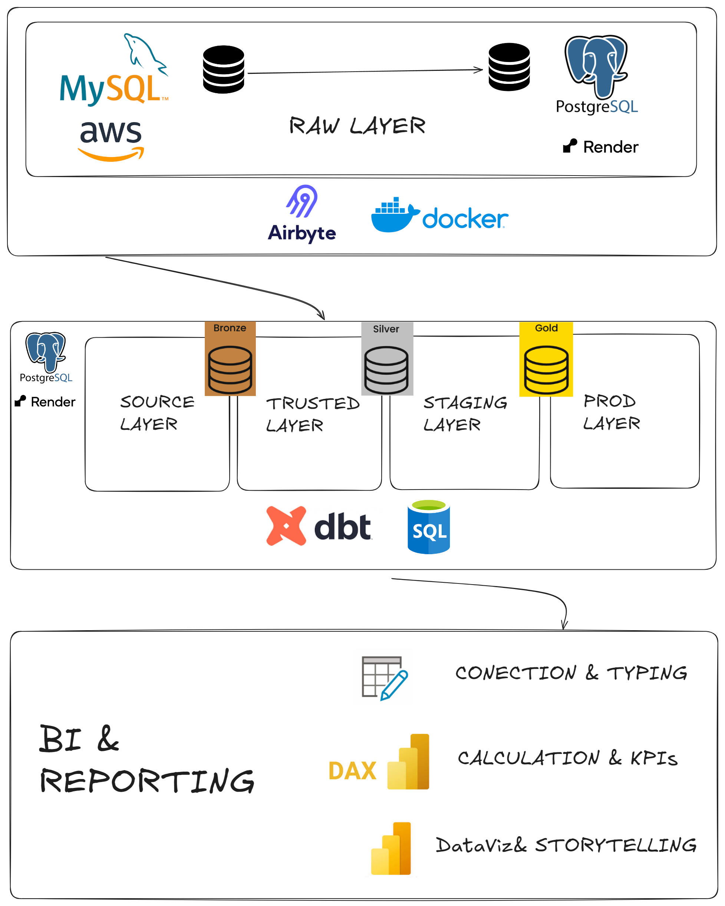
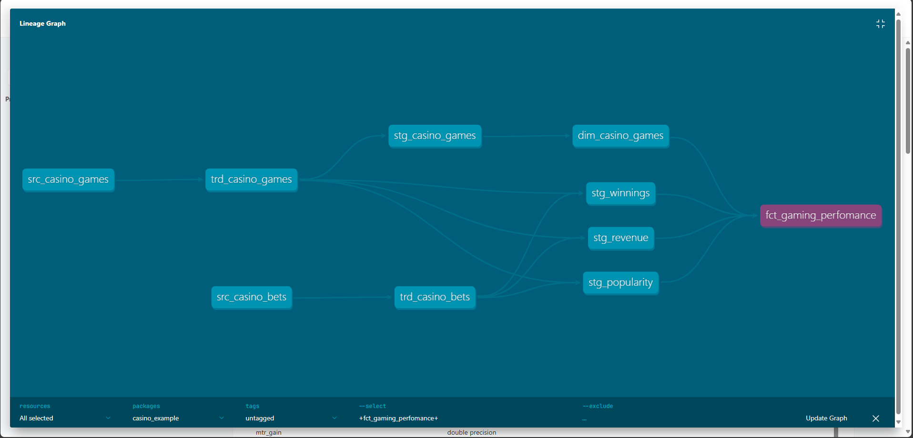
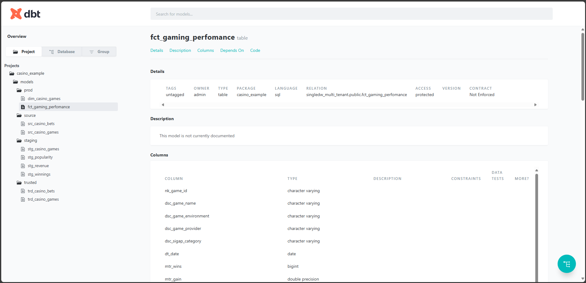

# Casino dbt Analytics

A demonstration of a modern analytics architecture for casino operations, using
**dbt** for modelling and transformation on top of **Power BI** for consumption.
The goal is to show the full path from raw ingestion to a dashboard someone can
actually make decisions with.

---

## Pipeline architecture



The pipeline is organised into layers, each with a distinct responsibility for
processing and governance:

- **Raw** — data is extracted from source systems such as MySQL (AWS) and
  loaded into PostgreSQL using tools like Airbyte and Docker.

- **Source, Trusted, Staging, Prod** — the transformation layers:

  | Layer | Tier | Responsibility |
  |---|---|---|
  | Source | Bronze | Raw data as extracted from the origin systems |
  | Trusted | Silver | Cleaned and validated data |
  | Staging | Silver | Pre-processed and enriched data |
  | Prod | Gold | Final models, ready for analysis and dashboards |

  All transformation happens in dbt and SQL, which keeps the pipeline
  traceable and version-controlled.

- **BI & reporting** — the final layer connects the data models to Power BI,
  where connection and typing happen, KPIs and metrics are calculated with
  **DAX**, and the result is visualised and told as a story for decision
  making.

---

## Data lineage



The lineage graph above, generated by dbt, traces the data from the source
tables (`src_casino_games`, `src_casino_bets`) through the intermediate
transformation layers (`trd_*`, `stg_*`) to the final fact model
(`fct_gaming_performance`). This is the traceability argument in picture form:
any number in the report can be walked back to the row that produced it.

---

## Example final model



`fct_gaming_performance` is an example fact table in the Prod layer,
consolidating the key metrics for casino game performance analysis. It carries:

- game identifiers and descriptions
- dates
- metrics for winnings, wagers and popularity

---

## Data tests

Models are documented but also **tested** — 17 tests, split between dbt's
built-in generics and singular SQL tests that encode the business rules:

| Test | What it protects against |
|---|---|
| `assert_fact_grain_is_unique` | The left joins to `stg_revenue` / `stg_popularity` fanning out and silently inflating every measure |
| `assert_rtp_within_bounds` | RTP is a ratio, so it must land in [0, 1] — anything else means a bad join upstream |
| `assert_metrics_non_negative` | Accumulative measures going negative (double-counted reversals, bad sign convention) |
| `assert_turnover_covers_bets` | One of the aggregations silently returning no rows for a game/day |
| `unique` / `not_null` on keys | Duplicate or null dimension keys |
| `relationships` fact → dim | Orphaned fact rows |

Run them with:

```bash
dbt test
```

---

## Skills demonstrated

- Layered analytics data architecture
- Dimensional modelling and ELT pipelines with dbt
- Data governance, traceability and documentation
- Dashboard construction and storytelling with Power BI

---

*Built as a demonstration and portfolio project. All data is fictional.*
